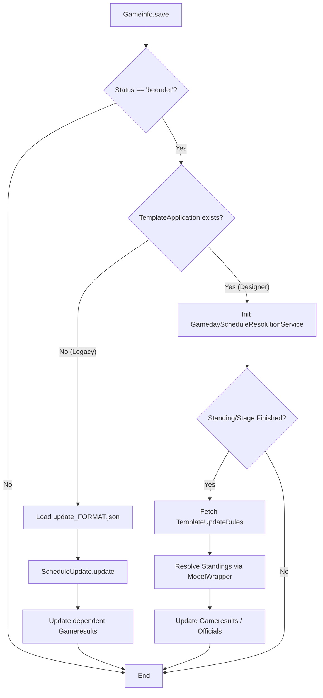
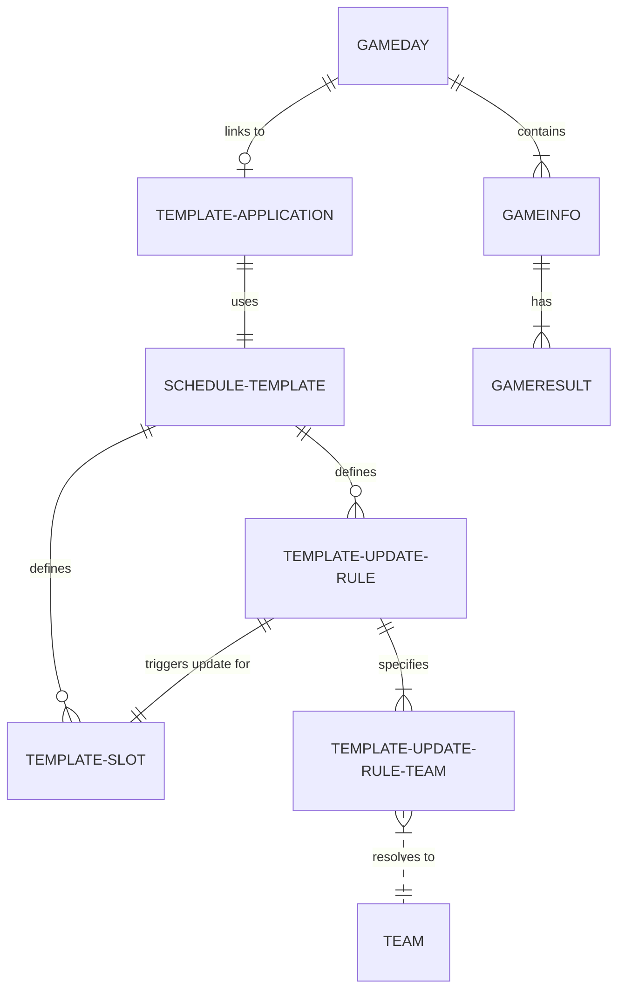
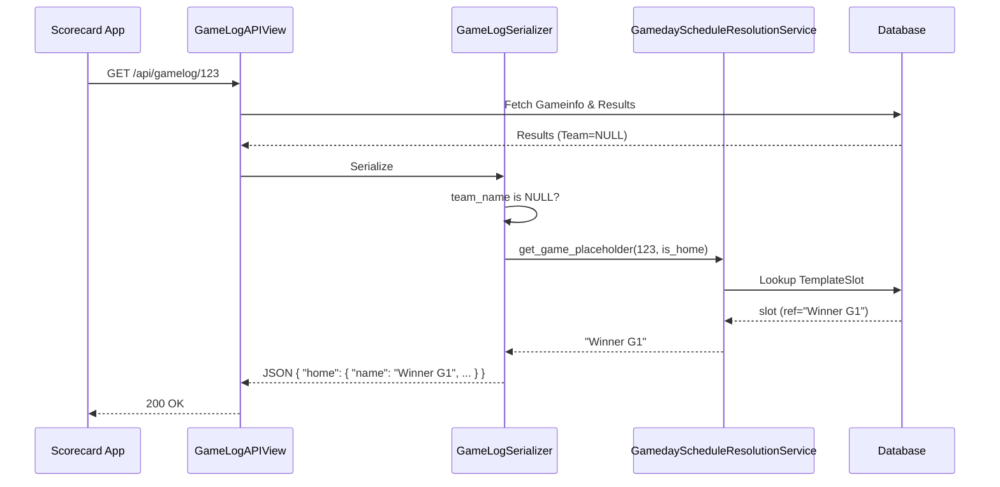

# Feature: Dual-Logic Tournament Progression

## Overview
This feature re-introduces advanced tournament progression logic required by the Gameday Designer while maintaining full backward compatibility for legacy gamedays. It uses a "router" signal approach to choose between JSON-based legacy logic and DB-template-driven Designer logic.

## Architecture: The Router Signal
The core of this transition strategy is an intelligent `post_save` signal handler for the `Gameinfo` model.

### Functional Flow
When a game is marked as `beendet` (Finished):
1. **Detection**: Check if the `Gameday` has a `TemplateApplication` record.
2. **Path A (Legacy)**: If no application exists, invoke the legacy `ScheduleUpdate` service which reads from `schedules/update_FORMAT.json`.
3. **Path B (Designer)**: If an application exists, invoke `GamedayScheduleResolutionService` which uses the database-backed `ScheduleTemplate` and `TemplateUpdateRule` models.

### Mermaid Flowchart: Signal Execution

## Data Model Relationship
The progression logic relies on the relationship between core gameday entities and the new designer template models.

### Mermaid ER Diagram

## Component Details

### 1. GamedayPlaceholderService (Encapsulation)
- **Location**: `gamedays/service/placeholder_service.py`
- **Responsibility**: The single source of truth for resolving "dummy" team names. It encapsulates the complex logic of matching a `Gameinfo` instance to a `TemplateSlot` based on its temporal position on a specific field.
- **Used by**:
    - `GamedayModelWrapper`: To fill dataframes for the Designer UI.
    - `GameLogSerializer`: To provide names for the Scorecard/Liveticker APIs.
    - `GameResultSerializer`: To provide names for the Designer's results entry mode.
    - `PasscheckGamesListSerializer`: To ensure officials see the correct upcoming matchups.
    - `GamedayGameService`: For internal backend logic and event logging.

### 2. GamedayScheduleResolutionService
- **Location**: `gamedays/service/schedule_resolution_service.py`
- **Responsibility**: Processes dynamic participant updates for Designer-based gamedays. It leverages the `PlaceholderService` for template lookup and applies rules to populate subsequent games.

### 3. GameLogSerializer Integration
- **Scorecard Support**: When a team name is missing in the result (common in future bracket games), the serializer calls `GamedayScheduleResolutionService.get_game_placeholder` to provide a human-friendly label for the UI.

## Scorecard Dependency & Placeholder Resolution

A critical requirement for this transition is ensuring the Scorecard (and Liveticker) remains usable even when teams are not yet determined (e.g., future playoff games).

### The "Null Team" Challenge
In the new Designer-based logic, `Gameresult` records for future bracket games are created with `team=NULL`. 
- **Legacy Logic**: Pre-populated dummy teams in the database.
- **Designer Logic**: Dynamic resolution at the API/Model layer.

### Implementation: Dynamic Placeholders
To handle this, both the Gameday Designer and the Scorecard API share a resolution strategy:

1. **GamedayModelWrapper**: Automatically populates the `team__name` column in dataframes by matching the `Gameinfo`'s position on a field to its corresponding `TemplateSlot`.
2. **GameLogSerializer**: When a team is `None` in a result, it invokes `GamedayScheduleResolutionService.get_game_placeholder(game_id, is_home)`.
3. **Resolution Logic**:
   - Matches game to template slot via field index and scheduled time.
   - Returns the `home_reference` / `away_reference` (e.g., "Gewinner HF1").
   - Fallback to group index (e.g., "G1_T1") or "TBD".

### Mermaid Flow: Scorecard Data Fetching

## Testing Strategy
Verification covers both logic paths to ensure zero regressions.

1. **Unit Tests**:
   - `TestSignalsDualLogic`: Verifies the signal calls the correct service based on gameday type.
   - `TestPlaceholderResolution`: Confirms that dataframes and serializers correctly show "Winner X" instead of empty fields.
2. **API Integration Tests**:
   - `ScorecardPlaceholderTest`: Specifically verifies that the `/api/gamelog/` endpoint returns human-readable placeholders for the Scorecard app.
3. **Regression Suite**:
   - Running full `pytest` suite for `gamedays` and `gameday_designer` (247+ tests) ensures legacy updates remain functional.

## Transition Phase
This dual-logic approach allows for a smooth deprecation of JSON files. Once all gameday formats are successfully migrated to the Designer and verified in production, the `ScheduleUpdate` path can be safely removed from `signals.py`.
